# Company Management Suite

A full-stack company management platform combining HR, payroll, attendance, documents, recruitment, messaging, and Jira/worklog tracking into a single role-based admin dashboard.

**Stack:** Vue 3 (Composition API) · Pinia · Tailwind CSS v4 · Django REST Framework · MySQL

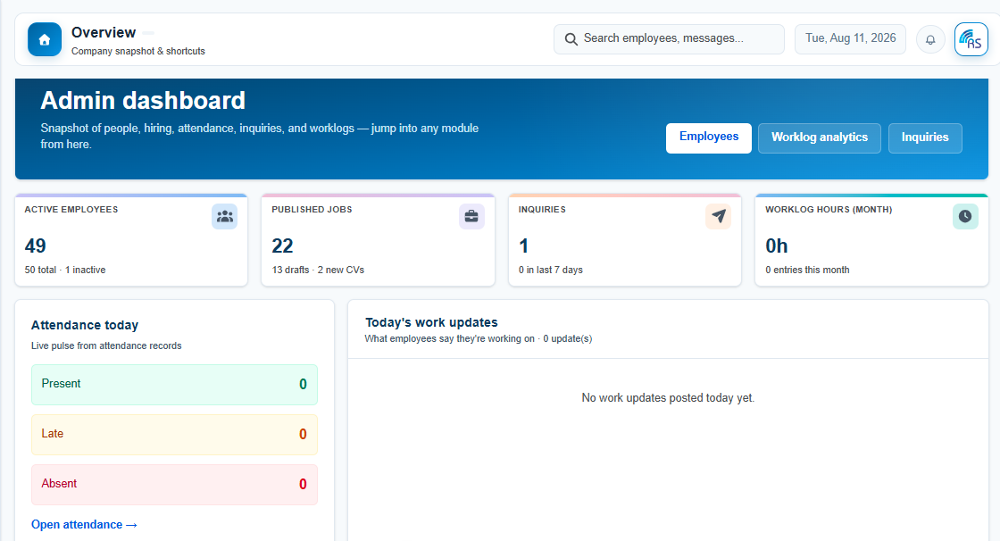

---

## ✨ Features

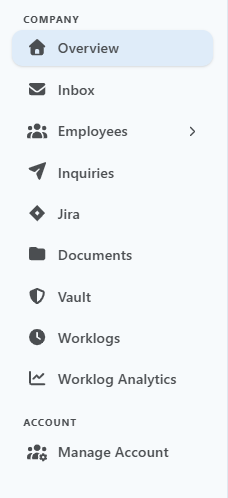

### 👥 HR & Employee Management
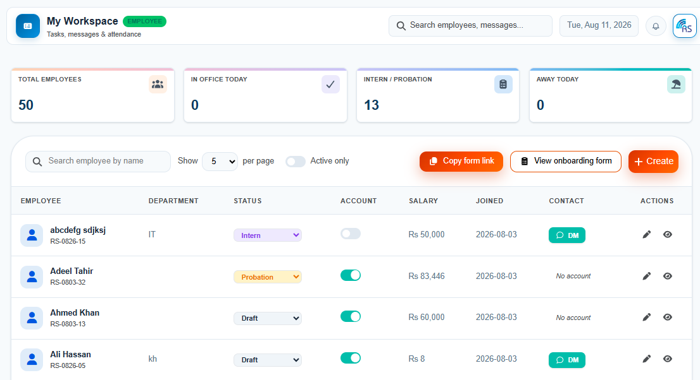
- Employee directory with search, pagination, and inline employment-status editing
- Full employee onboarding — either admin-created or via a shareable multi-step public onboarding form (personal details, emergency contact, education docs, bank info) with file uploads (CNIC, certificates, degrees)
- Employee detail view/edit with account security (password reset), personal info, emergency contacts, and bank details

### 💰 Payroll & Salaries
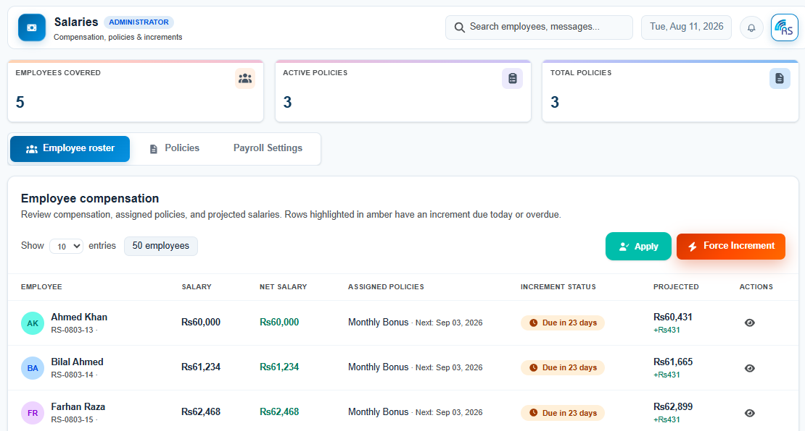
- Increment policy engine: create policies (amount, cycle, application mode — auto/manual), assign to employees, force-apply or apply-overdue increments
- Projected salary calculations and increment status tracking (due today / overdue)
- Configurable payroll settings: grace minutes, paid leave/absence allowances, overtime rate, late-penalty thresholds, office geofence radius
- Company holiday calendar with automatic attendance marking
- Per-employee salary breakdown: base vs. current salary, attendance-based deductions, late penalties, overtime, monthly bonus, tax, and insurance

### 🕒 Attendance
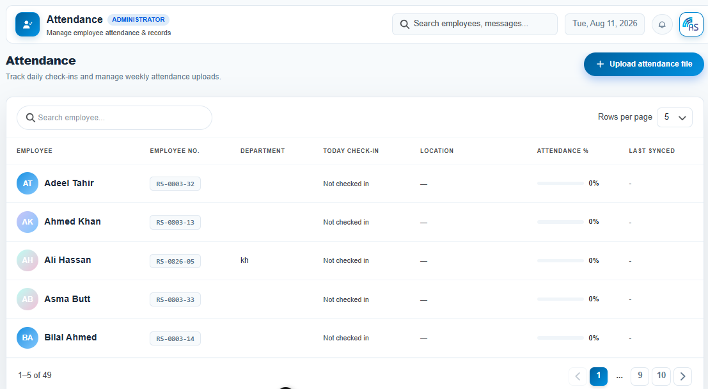
- Daily check-in/check-out tracking with GPS-based in-office/work-from-home detection and map links
- Bulk attendance upload via CSV/XLSX (matched to employees by Employee Number)
- Per-employee attendance history with status filters and date-range filtering

### 🌴 Leave Management
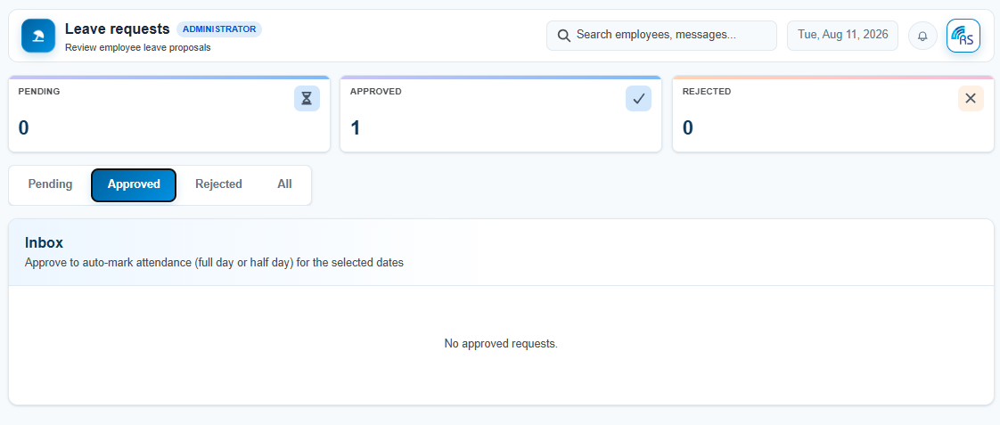
- Inbox-style leave request queue (pending / approved / rejected / all)
- Approve/reject with optional admin notes; auto-marks attendance (full day or half day) on approval

### 📁 Documents
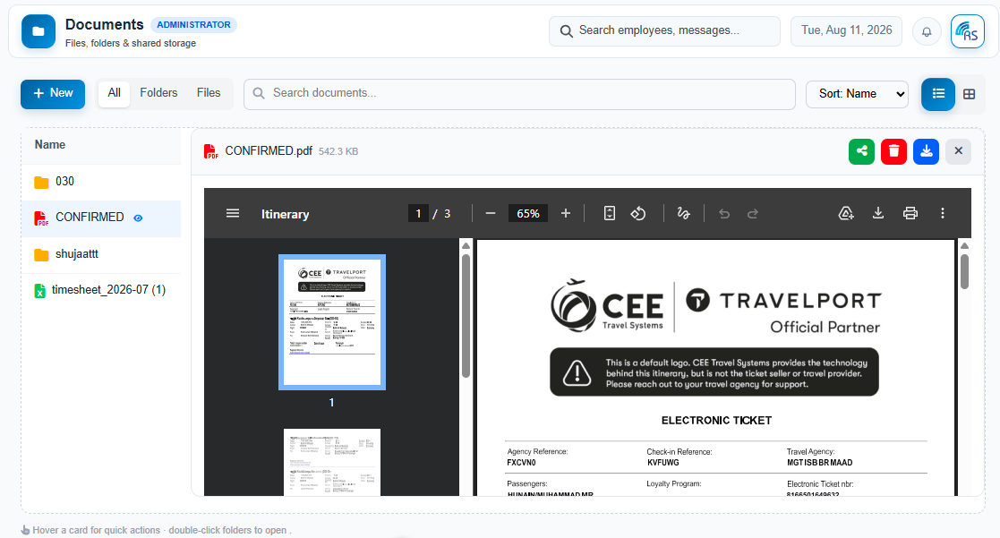
- Shared file/folder manager with drag-and-drop upload, folder creation, rename, delete
- Grid and list views with inline preview (PDF, image, video, audio, text)
- Per-document sharing to specific employees, with an employee-facing "Shared with me" view

### 💼 Careers & Recruitment
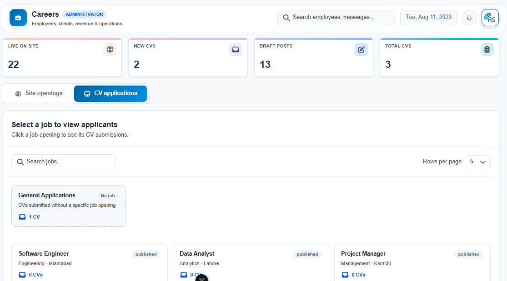
- Job posting CRUD (title, type, department, salary range, description, requirements) with Published/Draft/Closed status
- Public careers page (unauthenticated) showing only Published jobs
- CV application pipeline: per-job and "General Applications" (no job) buckets, applicant status (New/Reviewed/Shortlisted/Rejected), in-browser CV preview via `pdf.js`, and candidate email outreach

### 🔐 Credential Vault
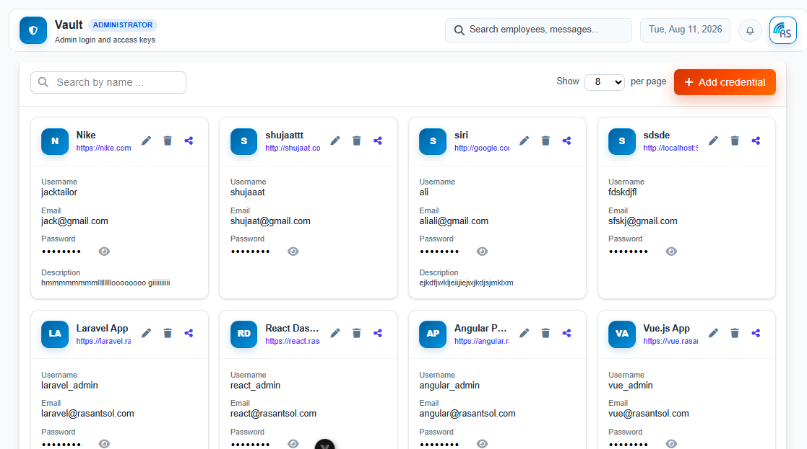
- Encrypted storage for shared login credentials (site, username, email, password) with strength indicators
- Per-credential sharing to employees, with revoke access

### 💬 Real-Time Inbox
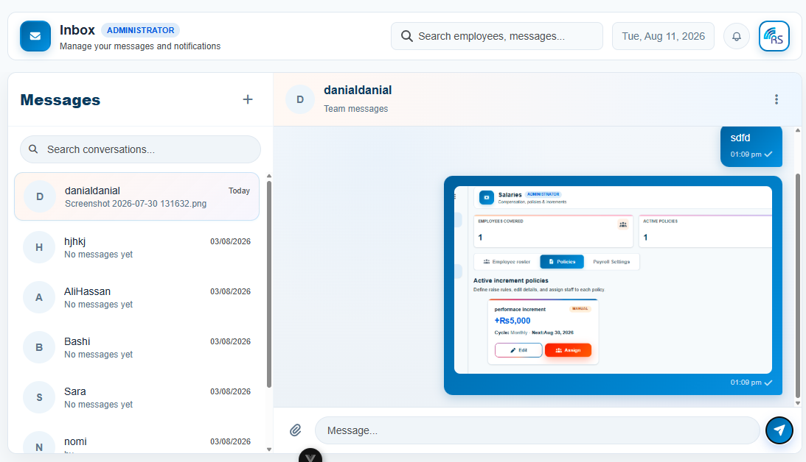
- WhatsApp-style messaging: 1:1 and group chats, read receipts, typing/online status, message deletion (for me / for everyone), file/image/video/audio attachments, group photo & member management
- Powered by Server-Sent Events (SSE) for live delivery

### 📬 Inquiries
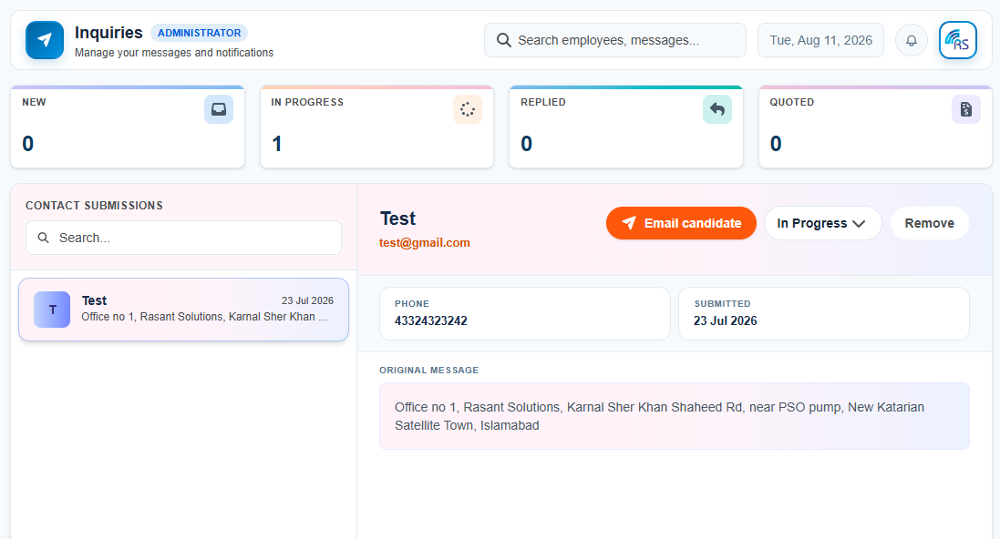
- Contact-form submission inbox with status pipeline (New / In Progress / Held / Closed/Resolved), reply history, and email-reply composer

### 🧩 Jira Integration
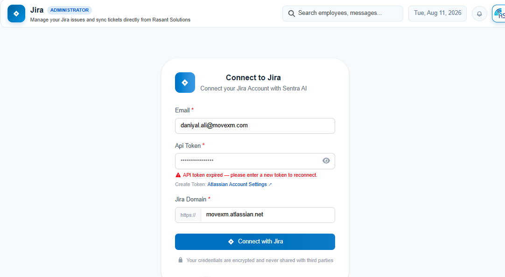
- Connect a Jira Cloud account (email + API token + domain)
- View, create, and delete issues; tabbed My Issues (To Do / In Progress / Done) with stats
- Attachment handling, subtasks, priorities, labels, sprints, and team assignment

### ⏱ Worklogs
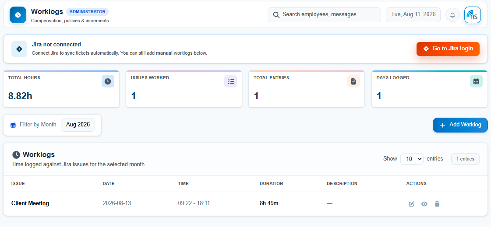
- Manual and Jira-synced time entries with live duration calculation
- Monthly grouping with a month picker, pagination, and monthly stats (total hours, issues worked, entries, days logged)

### ⚙️ Account Settings
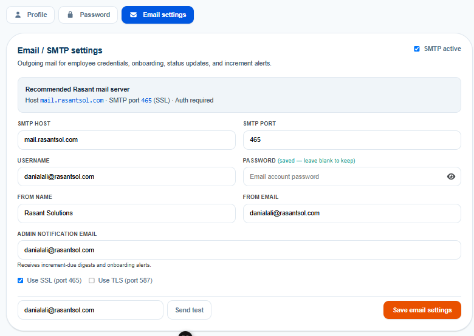
- Profile editing with avatar upload
- Password change
- Admin-only SMTP/email settings (host, port, SSL/TLS, credentials, from-address, test email)

---

## 🏗 Architecture

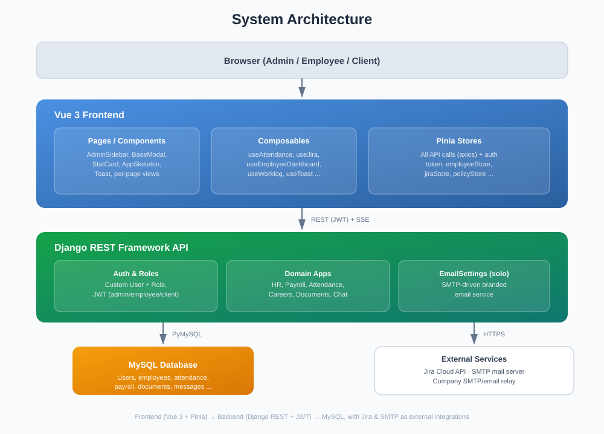

### Frontend
- **Vue 3** (`<script setup>` for templates, business logic extracted into **composables**)
- **Pinia** stores own all API calls; composables consume stores rather than calling APIs directly
- **Tailwind CSS v4** using the `@theme {}` directive — no `tailwind.config.js`; design tokens are CSS custom properties (purposeful naming, not `primary`/`secondary`)
- **Font Awesome** centralized via `src/fontAwesomeIcons/icon.js` (`library.add()`) — no CDN `<i>` tags
- **Vue Router** for all internal navigation — no plain `<a>` tags
- Shared `BaseModal.vue` / `BaseDetailModal.vue` for consistent modal UX across the app
- `useToast.js` as the single global toast/notification composable
- Reusable `AppSkeleton.vue` for loading states across tables, cards, lists, and forms
- `pdf.js` for in-app PDF rendering (CV previews, document previews)

### Backend
- **Django REST Framework** with a custom `User(AbstractUser)` + `Role` model (role-based JWT auth: `admin` / `employee` / `client`)
- **MySQL** via PyMySQL
- DB-backed `EmailSettings` (solo pattern) driving all outbound email (welcome, OTP, onboarding, leave, inquiry replies, job publishing, etc.)
- CORS via `django-cors-headers`

---

## 📂 Suggested Structure

```
src/
├── components/        # Shared UI (BaseModal, AdminSidebar, header, StatCard, ToastContainer, ...)
├── composables/        # All business logic (useAttendance, useEmployeeDashboard, useJira, ...)
├── stores/              # Pinia stores (API calls live here)
├── pages/
│   └── admin/           # Route-level views (Employee, Careers, Salaries, Documents, Inbox, Jira, ...)
├── services/            # baseUrl.js — API_ENDPOINTS constants
├── fontAwesomeIcons/     # Centralized icon registration
└── main.css              # Design tokens + Tailwind v4 theme
```

---

## 🚀 Getting Started

```bash
# Frontend
npm install
npm run dev

# Backend (Django)
pip install -r requirements.txt
python manage.py migrate
python manage.py runserver
```

Configure environment variables for the database connection, JWT secret, and (optionally) initial SMTP/Jira credentials via the in-app settings pages.

---


Internal project — © All rights reserved.
